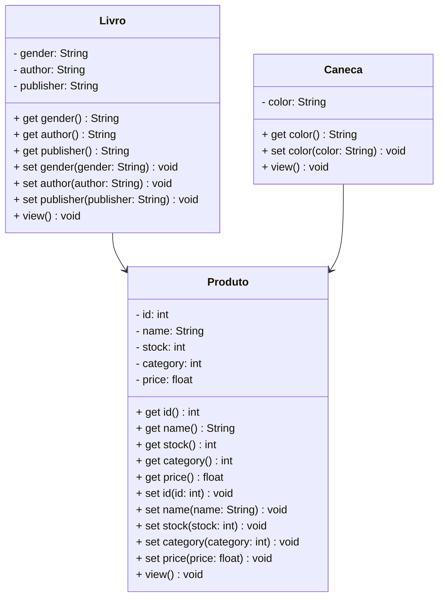

# Projeto Livraria - Java

<br />

<div align="center">
	
</div>
<br />

<div align="center">
  
  
  
  
  
  
</div>

------

<br />

## 1. Descrição

<br />


O **Projeto Livraria** é um sistema de gestão projetado para simular e administrar operações relacionadas a um sistema de livraria. Oferece funcionalidades como **cadastro**, **consulta**, **atualização** e **remoção** de produtos.

O sistema organiza as informações dos produtos — incluindo nome , ID, preço, estoque e categoria. Seu principal objetivo é automatizar e simplificar o gerenciamento de produtos, como Livros e Canecas, promovendo agilidade e precisão no controle.

Este projeto, desenvolvido em **Java**, foca no estudo e aplicação dos conceitos de **Programação Orientada a Objetos (POO)**, incluindo:

- Classes e Objetos;
- Atributos e Métodos;
- Modificadores de Acesso;
- Herança e Polimorfismo;
- Classes Abstratas;
- Interfaces.

Além de servir como um simulador funcional, o projeto oferece uma base prática para compreender os princípios fundamentais da POO aplicados a um cenário realista.

<br />

## 2. Funcionalidades do Projeto

<br />

1. **Cadastrar Produto:** Cadastra um novo produto  especificando nome, preço, estoque e propriedades específicas conforme a categoria do produto. O ID do produto é gerado automaticamente.
2. **Listar todos os Produtos:** Lista todos os produtos cadastrados no sistema.
3. **Consultar um Produto pelo ID:** Encontra um produto pelo ID.
4. **Atualizar preço do Produto:** Permite atualizar o preço de um produto existente a partir do ID do produto.
5. **Excluir Produto:** Remove um produto específico com base no ID do produto.

<br />

## 3. Diagrama de Classes

<br />

Um **Diagrama de Classes** é um modelo visual usado na programação orientada a objetos para representar a estrutura de um sistema. Ele exibe classes, atributos, métodos e os relacionamentos entre elas, como associações, heranças e dependências.

Esse diagrama ajuda a planejar e entender a arquitetura do sistema, mostrando como os componentes interagem e se conectam. É amplamente utilizado nas fases de design e documentação de projetos.

Abaixo, você confere o Diagrama de Classes do Projeto Livraria:



<br />

## 4. Tela Inicial do Sistema - Menu

<br />

<div align="center">
   
</div>

<br />

## 5. Implementações Futuras

<br />

Abaixo estão algumas das funcionalidades que serão implementadas no futuro:

- [ ]  **Simulador de Carrinho de Compras**: Função para simular a compra de produtos.

<br />

## 6. Requisitos

<br />

Para executar os códigos localmente, você precisará de:

- [Java JDK 17+](https://www.oracle.com/java/technologies/javase/jdk17-archive-downloads.html)
- [Eclipse](https://eclipseide.org/) ou [STS](https://spring.io/tools)

<br />

## 7. Como Executar o projeto no Eclipse/STS

<br />

### 7.1. Importando o Projeto

1. Clone o repositório do Projeto [Livraria](https://github.com/queren-alves/livraria) dentro da pasta do *Workspace* do Eclipse/STS

```bash
git clone https://github.com/queren-alves/livraria.git
```

2. **Abra o Eclipse/STS** e selecione a pasta do *Workspace* onde você clonou o repositório do projeto
3. No menu superior do Eclipse/STS, clique na opção: **File 🡲 Import...**
4. Na janela **Import**, selecione a opção: **General 🡲 Existing Projects into Workspace** e clique no botão **Next**
5. Na janela **Import Projects**, no item **Select root directory**, clique no botão **Browse...** e selecione a pasta do Workspace onde você clonou o repositório do projeto
6. O Eclipse/STS reconhecerá automaticamente o projeto
7. Marque o Projeto Conta Bancária no item **Projects** e clique no botão **Finish** para concluir a importação

<br />

### 7.2. Executando o projeto

1. Na guia **Package Explorer**, localize o Projeto Conta Bancária
2. Abra a **Classe Menu**
3. Clique no botão **Run**  para executar a aplicação
4. Caso seja perguntado qual é o tipo do projeto, selecione a opção **Java Application**
5. O console exibirá o menu do Projeto.

<br />

## 8. Contribuição

<br />

Este repositório é parte de um projeto educacional, mas contribuições são sempre bem-vindas! Caso tenha sugestões, correções ou melhorias, fique à vontade para:

- Criar uma **issue**
- Enviar um **pull request**
- Compartilhar com colegas que estejam aprendendo Java.

<br />

##  9. Contato

<br />

Desenvolvido por [**Quéren**](https://github.com/queren-alves)
Para dúvidas, sugestões ou colaborações, entre em contato via GitHub ou abra uma issue.